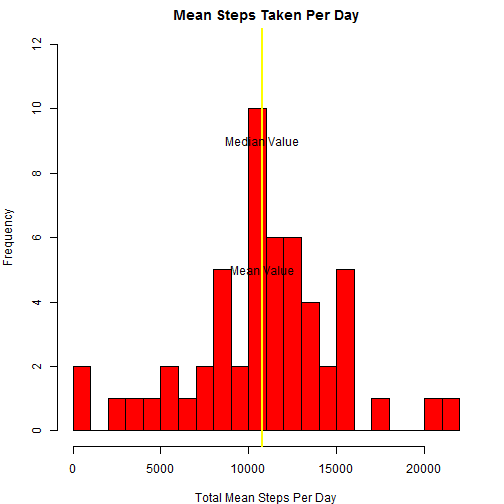
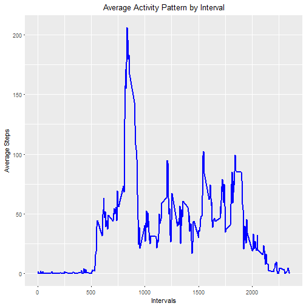
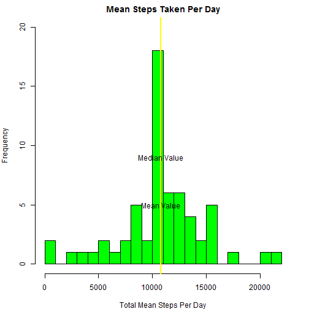
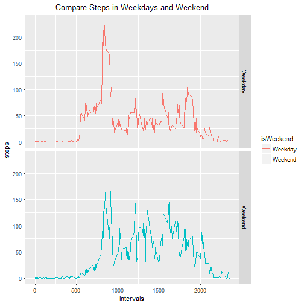

Course 5 Week 2 Project
=======================
# Reproducible Research Week 2 Project Assignment

## Load packages and data
First we load some packages that may be useful


```r
library(dplyr)
library(ggplot2)
```

Then we set the working directory load the data that need to be analyzed

```r
setwd("E:/Skill building/R Learning and Practice/Course5 Week2")
df <- read.csv("./activity.csv",sep = ",",header = TRUE)
```

## Q1: What is mean total number of steps taken per day?


```r
## pre-process the data and get the mean total steps value
mspd <- tapply(df$steps, df$date, sum) ## mspd refers to "mean steps per day"

processList <- function(x)
{
	len <- length(x)
	mspd <- rep(0, len)
	for(i in 1:len)
	{
		mspd[i] <- x[[i]]	
	}
	mspd
}

mspd <- processList(mspd)

## plot the hisgram and add annotation
par(mar = c(4,4,2,2))
hist(mspd, main=NULL, breaks=30, xlab=NULL, col="red", ylim=c(0,12))
title(main = "Mean Steps Taken Per Day", xlab = "Total Mean Steps Per Day")

## calculate the mean and median value of the total mean steps taken
mean_step <- mean(mspd, na.rm = TRUE)
median_step <- median(mspd, na.rm = TRUE)

abline(v = mean_step, lwd=2, col = "yellow")
text(mean_step, 5, "Mean Value")
abline(v = median_step, lwd=2, col = "yellow")
text(median_step, 9, "Median Value")
```



The mean total number of steps taken perday is:

```
## [1] 10766.19
```

The median total number of steps taken perday is:

```
## [1] 10765
```

In fact, the median and mean steps taken are so close so they are hard to be distinguished in the graph above

## Q2: What is the average daily activity pattern?

```r
df1 <- df
df1$interval <- as.factor(df1$interval)
mspd1 <- tapply(df1$steps, df1$interval, mean, na.rm = T)
mspd1 <- as.data.frame(mspd1)

interval <- as.numeric(rownames(mspd1))
mspd1 <- mutate(mspd1, intervals = interval)
rm(interval)
names(mspd1) <- c("steps", "interval")

g <- ggplot(data = mspd1, aes(x=interval, y=steps))
g <- g + geom_line(linetype = 1, col = "blue", lwd = 1)
g <- g + labs(title="Average Activity Pattern by Interval") + labs(x="Intervals") + labs(y="Average Steps")
g <- g + theme(plot.title = element_text(hjust = 0.5)) ## make the title to be at the middle of the plot
g <- g + guides("legend")
print(g)
```



The following codes calculate the 5-minute interval which contains the maximum steps


```r
max <- max(mspd1$steps)
max_int <- mspd1[which(mspd1$steps==max),][,2]
```

The 5-minute interval which contains the maximum steps is:


```
## [1] 835
```

## Q3: How to Handle missing data?
First, calculate the total number of missing values in the dataset

```r
na <- as.numeric(sum(is.na(df$steps)))
```

The total number of missing values is:

```
## [1] 2304
```

In next step, we fill these missing values by assigning them using average steps taken in the same interval in the total 61 days

```r
## create a function to loop over all intervals in the dataset
naHandle <- function(x) ## x is the data frame
{
  len <- length(x[ ,1])

  for(i in 1:len)
  {
	  if(is.na(x[i,1]))
    {
      itv <- x[i,3]
      x[i,1] <- mspd1[which(mspd1$interval==itv), ][[1]]
    }	
  }
  x
}

df_noNA <- naHandle(df)
head(df_noNA)
```

```
##       steps       date interval
## 1 1.7169811 2012-10-01        0
## 2 0.3396226 2012-10-01        5
## 3 0.1320755 2012-10-01       10
## 4 0.1509434 2012-10-01       15
## 5 0.0754717 2012-10-01       20
## 6 2.0943396 2012-10-01       25
```

```r
## make a histgram of the new developed data frame
mspd2 <- tapply(df_noNA$steps, df$date, sum)
mspd2 <- processList(mspd2)

## plot the hisgram and add annotation
par(mar = c(4,4,2,2))
hist(mspd2, main=NULL, breaks=30, xlab=NULL, col = "green", ylim=c(0,20))
title(main = "Mean Steps Taken Per Day", xlab = "Total Mean Steps Per Day")

## calculate the mean and median value of the total mean steps taken
mean_step <- mean(mspd2)
median_step <- median(mspd2)

abline(v = mean_step, lwd=2, col = "yellow")
text(mean_step, 5, "Mean Value")
abline(v = median_step, lwd=2, col = "yellow")
text(median_step, 9, "Median Value")
```



The mean total number of steps taken perday is:

```
## [1] 10766.19
```

The median total number of steps taken perday is:

```
## [1] 10766.19
```

After the missing values are handled, the frequency of steps whose number equals the mean or median value increase while the frequencies of other steps remain unchanged.

## Q4: Are there in activity patterns between weekdays and weekends?

```r
df_noNA$date <- as.character(df_noNA$date)
df_noNA$date <- as.Date(df_noNA$date)
df_noNA <- mutate(df_noNA, day=weekdays(date))
df_noNA <- mutate(df_noNA, IfWeekend = ifelse((day=="ÐÇÆÚÁù"|day=="ÐÇÆÚÈÕ"),"Weekend","Weekday"))
df_noNA$interval <- as.factor(df_noNA$interval)
df_noNA$IfWeekend <- as.factor(df_noNA$IfWeekend)

## separate the data according to whether the day is weekend
df_end <- subset(df_noNA, IfWeekend=="Weekend")
df_week <- subset(df_noNA, IfWeekend=="Weekday")

## get the average steps by interval in both of the dataset obtained above
mspd_end <- tapply(df_end$steps, df_end$interval, mean)
mspd_week <- tapply(df_week$steps, df_week$interval, mean)

handleList <- function(x)
{
  len <- length(x)
  result <- rep(0, len)
  for(i in 1:len)
  {
      result[i] <- x[[i]]
  }
  result
}

df_merge <- data.frame(interval=rep(mspd1$interval, 2), step=c(handleList(mspd_end), handleList(mspd_week)), isWeekend = as.factor(rep(c("Weekend","Weekday"),each=288)), row.names = NULL)

## plot the results
g <- ggplot(data = df_merge, aes(x=interval, y=step))
g <- g + facet_grid(isWeekend~.)
g <- g + geom_line(aes(col=isWeekend))
g <- g + labs(title="Compare Steps in Weekdays and Weekend")+labs(x="Intervals")+labs(y="steps")
g <- g + theme(plot.title = element_text(hjust = 0.5))
print(g)
```


The plot tells us that the steps taken in morning of weekdays is greater than steps taken in weekend mornings; during the afternoon, steps taken in weekdays and weekend are similar.
